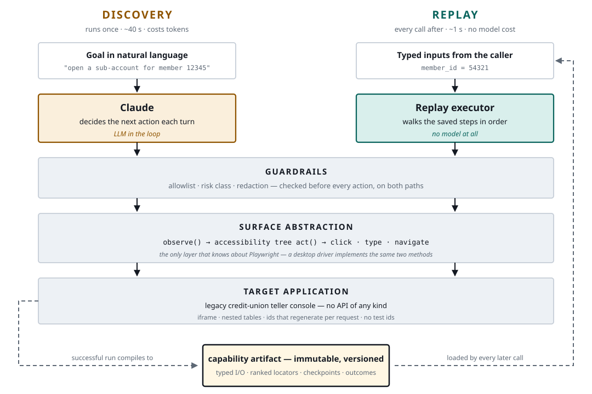
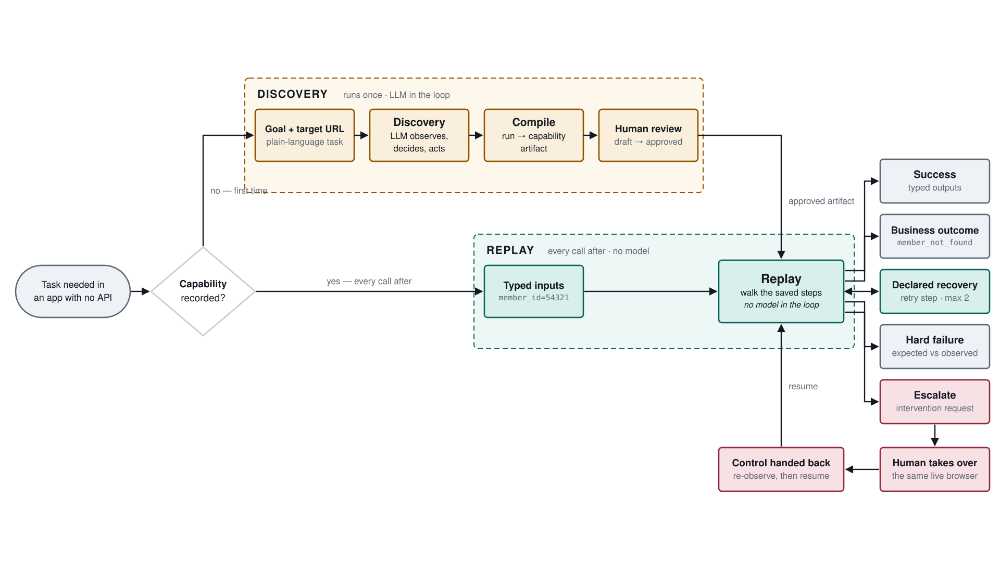

# ui-capability-compiler

Discover a legacy UI flow with an LLM **once**. Compile it into a typed,
versioned **capability**. Replay it deterministically with **no model in the
loop** — with a real human handoff on the same live browser session.

> The model discovers. The artifact becomes a reusable capability.
> Deterministic replay is how an agent invokes it in production.



**`replay` never reads `ANTHROPIC_API_KEY`.** That is the thesis, and it doubles
as the answer to "how do I run this without live services" — every command below
except `discover` works with no API key and no network.

Design decisions and trade-offs: **[REPORT.md](REPORT.md)**.

---

## Setup

```bash
uv sync
uv run playwright install chromium
cp .env.example .env        # add ANTHROPIC_API_KEY — needed only for `discover`
```

Python 3.11+ and [uv](https://docs.astral.sh/uv/). One process per role, flat
files, no database or queue.

Start the target application in its own terminal and leave it running:

```bash
uv run uvicorn mock_app.main:app --port 8000
```

`mock_app/` is a deliberately legacy credit-union teller console:

- work area **two iframes deep**
- table-soup layout, **zero** test ids
- element ids regenerate every request — `ctl00_{random6}_txtMemberId`
- the sub-account form labels its controls with plain `<td>` text, not
  `<label for>` — which is why the locator ladder has a `label_adjacent` rung

---

## Demo path



### The whole thread in one command

```bash
uv run python -m src.cli demo
```

Runs **discover → review → approve → replay**, printing each underlying command
before it runs, so what you see is exactly what you would type by hand. Add
`--headed` to watch both runs, `--yes` to skip the approval prompt, and
`--skip-discover` to reuse the artifact on disk instead of spending an API call.

The approval prompt is deliberate, not ceremony: discovery emits a **draft**, and
a draft may not run unattended until a human has looked at it. The four steps
below are what that command chains together.

### 1. Discover — a model drives the live UI *(needs the API key)*

```bash
uv run python -m src.cli discover \
  --goal "Sign in, look up the member, and open a new savings sub-account, reaching the confirmation screen" \
  --target http://localhost:8000/login \
  --input member_id=12345 --input account_type=Savings \
  --input initial_deposit=250.00 --input nickname=Vacation
```

Writes `runs/discovery-<ts>/` (transcript, screenshots, Playwright trace) and
compiles it to `artifacts/member.open_subaccount.v1.json`, `status: draft`.
One run ≈ 11 steps, ≈ $0.055. Add `--headed` to watch it.

> Artifacts are immutable. Running `discover` again writes **v2**, not v1.

### 2. Approve — a human reviews before it runs unattended

```bash
uv run python -m src.cli show    --artifact artifacts/member.open_subaccount.v1.json
uv run python -m src.cli approve --artifact artifacts/member.open_subaccount.v1.json
```

### 3. Replay — no model, deliberately different inputs

```bash
uv run python -m src.cli replay \
  --artifact artifacts/member.open_subaccount.v1.json \
  --input member_id=54321 --input account_type=Savings \
  --input initial_deposit=99.50 --input nickname=Holiday
```

Different member, different amount, **1.0 s**, exit 0 — returning the
confirmation number and new account number read off the final screen. That
difference is what separates a parameterized capability from a recorded macro.

---

## Exit codes

A calling agent branches on these. `success` and `business_outcome` are both
normal answers; only `failed` means something is broken.

| Code | Status | Meaning |
|---|---|---|
| 0 | `success` | completed; declared outputs returned |
| 1 | `failed` | hard failure, with step / expected / observed |
| 2 | `caller_error` | inputs did not match the declared contract |
| 3 | `business_outcome` | a legitimate answer, e.g. `member_not_found` |
| 5 | `escalated` | needed a human; nobody took it |
| 6 | `blocked_by_policy` | a guardrail refused the action |

`recoverable` is deliberately **not** an exit code — see [REPORT §3](REPORT.md).

---

## Exercising the error taxonomy

All of it in one pass, with a ✓ per expected exit code:

```bash
uv run python scripts/demo_taxonomy.py          # add --pause to step through
```

Or by hand. Faults are armed through an endpoint, never a code edit. Each fires
once and disarms.

```bash
inject() { curl -s -X POST -H 'Content-Type: application/json' \
             -d "{\"mode\":\"$1\"}" http://localhost:8000/admin/inject >/dev/null; }

R() { uv run python -m src.cli replay --artifact artifacts/member.open_subaccount.v1.json \
        --input member_id=${1:-54321} --input account_type=Savings \
        --input initial_deposit=${2:-99.50} --input nickname=Holiday \
        --unattended --wait-s 5; echo "exit=$?"; }
```

| Command | Result | Exit |
|---|---|---|
| `R` | `success` | 0 |
| `R 99999` | `business_outcome` / `member_not_found` | **3** |
| `R 55555` | `business_outcome` / `permission_denied` | **3** |
| `R 54321 abc` | `caller_error` — fails before opening a browser | 2 |
| `inject interstitial; R` | dismisses the banner, **still succeeds** | **0** |
| `inject timeout; R` | `failed`, expected vs observed | 1 |
| `inject unknown_dialog; R` | `escalated`, files an intervention request | 5 |
| `inject slow; R` | waits on the checkpoint's own timeout; no `sleep()` | 0 |
| `inject server_error; R` | 500 from the work area | 1 |
| `inject clear` | disarms | — |

Two worth staring at:

- **`R 99999` exits 3, not 1.** "No such member" is a business answer, not a
  crash. The executor checks declared outcomes *first*, before concluding a
  locator is broken.
- **`inject interstitial` exits 0.** The artifact declares that banner and how to
  clear it, so replay dismisses it and carries on. The recovery shows up in
  `result.recoveries`.

Replaying a `draft` artifact with `--unattended` is blocked at the first
irreversible step (exit 6) and files an intervention request.

---

## Human escalation and handoff

Three terminals.

```bash
# 1 — the application
uv run uvicorn mock_app.main:app --port 8000

# 2 — the operator console
uv run python -m src.cli console --port 5056

# 3 — arm an undeclared dialog, then run headed
curl -s -X POST -H 'Content-Type: application/json' \
  -d '{"mode":"unknown_dialog"}' http://localhost:8000/admin/inject

uv run python -m src.cli replay --artifact artifacts/member.open_subaccount.v1.json \
  --headed --wait-s 600 \
  --input member_id=54321 --input account_type=Savings \
  --input initial_deposit=99.50 --input nickname=Holiday
```

The automation pauses and stops sending commands. **The Chromium window stays
open.** Then:

1. Open <http://localhost:5056> and click into the request — note the
   **Parameters** row reads *Withheld*
2. Switch to that Chromium window, complete the override, click **Approve**
3. Back in the console, press **Hand control back to the agent**
4. The run re-observes from scratch and finishes: `success`, exit 0

`http://localhost:9222` is the browser's DevTools endpoint for
`connect_over_cdp()` — a machine-to-machine API, **not a page to open**. The
console refuses to bind that port for exactly that reason.

The resume button appends to `runs/<run>/control.jsonl`, the same file the paused
run polls. The audit trail **is** the control channel, so the two cannot
disagree.

Scripted version of the whole cycle:

```bash
uv run python scripts/escalation_demo.py
```

---

## Multi-tenant

`tenant-overrides/community.yaml` adapts the base recording to a second
institution running the same vendor product — renamed controls plus one extra
acknowledgement step — without re-recording anything.

```bash
MOCK_TENANT=community uv run uvicorn mock_app.main:app --port 8000

# base artifact, no override  -> fails at the renamed control
uv run python -m src.cli replay --artifact artifacts/member.open_subaccount.v1.json …

# same artifact, with override -> succeeds
uv run python -m src.cli replay --artifact artifacts/member.open_subaccount.v1.json \
  --tenant community …
```

An override may patch **mechanics only**. The merge recomputes the contract hash
and refuses anything that would change what the capability returns.

## Drift

```bash
uv run python -m src.cli drift --capability member.open_subaccount
```

Compares the last run's locator rungs against the ones recorded at discovery. A
step that resolved at rung 1 when recorded and rung 3 today still works — but the
surface has moved underneath it. That is the signal to re-record, and it arrives
before the capability breaks outright.

---

## Credentials

A capability *references* secrets; it never carries them. A step typing into a
control whose accessible name reads like a credential compiles to
`{{ secrets.<field> }}`, resolved at run time:

```bash
export CAPABILITY_SECRET_PASSWORD=...        # consumed by {{ secrets.password }}
```

Whatever is resolved is registered for redaction *before* it is typed, so it
cannot reach a log, a trace or an artifact. The sandbox accepts any credentials,
so the demo works with nothing exported.

---

## Tests

```bash
uv run pytest          # 68 pass + 1 intentional xfail, ~15 s
```

Integration tests start the mock app themselves and drive a real browser.

| File | Covers |
|---|---|
| `test_boundary.py` | `src/replay/` never imports `anthropic` or `src.agent`, directly or transitively |
| `test_artifact.py` | round-trip, hash stability, immutability, versioning |
| `test_overrides.py` | contract guard fires on outputs, passes on mechanics |
| `test_guardrails.py` | risk table, allowlist, draft/approved policy |
| `test_redaction.py` | nothing sensitive reaches a run directory |
| `test_compiler.py` | parameterization, canonicalization, ladder, credentials |
| `test_resolver.py` | rung fallthrough, exhaustion, `bbox` gating |
| `test_replay.py` | every taxonomy bucket against the live app |
| `test_evidence.py` | no member id or balance in committed evidence, **archives opened**; names are an intentional `xfail` |

---

## Evidence

Nothing under `evidence/` is hand-assembled. Playwright traces and success-screen
screenshots are deliberately **not** committed — neither passes through redaction —
and stay under `runs/` for local debugging. Regenerate with:

```bash
uv run python scripts/make_evidence.py      # replay, outcomes, faults, tenants
uv run python scripts/escalation_demo.py    # the full handoff cycle
```

| Directory | Shows |
|---|---|
| `discovery-run/` | the real Claude Sonnet 5 run + the artifact it produced — paired by `discovery_run_id` |
| `replay-success/` | different inputs than discovery, exit 0 |
| `replay-business-outcome/` | `member_not_found`, exit 3 |
| `replay-hard-failure/` | injected timeout, expected vs observed, exit 1 |
| `replay-recovered/` | declared recovery applied, still exit 0 |
| `tenant-variant/` | base artifact without then with the override |
| `escalation/` | escalate → CDP handoff → resume → complete |

---

## Layout

```
mock_app/            the hostile legacy stand-in + fault injection
capability_specs/    hand-authored business outcomes — the human half of the contract
src/types.py         Surface protocol, Observation, Action
src/surface/         the only place playwright is imported
src/agent/           the discovery loop — the only place a model decides anything
src/artifact/        schema, compiler, store, tenant overrides
src/replay/          the deterministic path: resolver ladder, checkpoints, taxonomy
src/guardrails/      allowlist, risk classes, redaction
src/escalation/      controller token, intervention requests, operator console
scripts/             evidence + escalation demo generators
evidence/            curated runs, committed
runs/                working run directories (gitignored)
```
