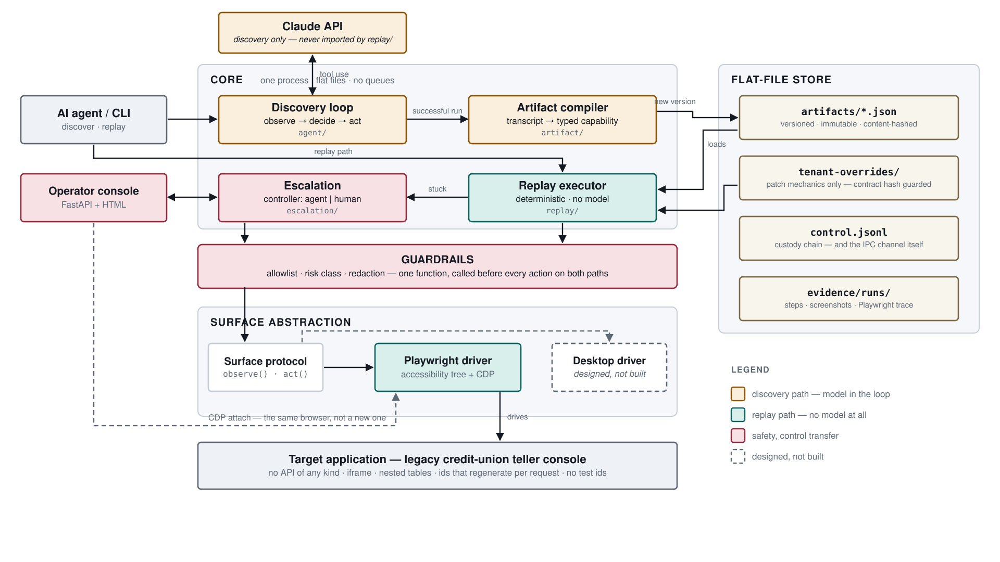

# REPORT

An LLM discovers how to do a task in a legacy bank UI once. The run compiles into a
typed, versioned **capability** that replays deterministically with **no model in
the loop** — and hands the live session to a human when it gets stuck.

Measured: discovery 11 steps / ~$0.055 · replay **1.0 s**, no API key · 68 tests ·
**9 independent discovery runs → 1 contract hash, 1 step sequence**.

---

## 1. Architecture



**Three processes for three lifetimes:** `mock_app` (the target), `cli` (one run
each), and `console`, which must outlive any run so an operator can reach a blocked
one. No queue, broker or database — a run is a sequential conversation with one
browser, which is also why Playwright is used through its **sync** API.

**The `Surface` seam.** Everything above the driver uses three methods:

```python
class Surface(Protocol):
    def observe(self) -> Observation: ...
    def act(self, action: Action) -> ActResult: ...
    def close(self) -> None: ...
```

Only `playwright_driver.py` imports Playwright. Above it, code knows roles, names
and checkpoints — never selectors.

**Dependency direction, enforced.** `replay/` imports `artifact`, `surface` and
`guardrails`, never `anthropic` or `agent/`. `tests/test_boundary.py` walks every
replay module with `ast` and fails if either is reachable, even transitively —
proving the central claim in code rather than prose.

**Perception is the accessibility tree** — the only stable thing on a page whose ids
regenerate every request. It also solves unlabelled legacy forms: an unnamed
`textbox` still sits in a `row "Initial Deposit"`, so the normalizer takes its label
from the row. No DOM inspection, so the rule ports to a desktop AX tree.

---

## 2. Artifact schema

| | Contract | Mechanics |
|---|---|---|
| Fields | inputs, outputs, success, business outcomes | steps, locators, recoveries, baseline rungs |
| Depends on it | the calling agent | this surface, today |
| A tenant may patch it | **no** | yes |
| Covered by `contract_hash` | yes | no |

**Parameterized, not recorded.** Typed values that match a launch input become
templates (`{{ inputs.member_id }}`); routes canonicalize to `/members/:member_id`.
Discovery ran 12345 / 250.00; replay runs 54321 / 99.50.

**A ranked ladder per target, each with a written rationale:**

| Rung | Strategy | Chosen when |
|---|---|---|
| 1 | `role_name` | the control has an accessible name |
| 2 | `label_adjacent` | no name; its row's leading cell labels it |
| 3 | `table_anchor` | a cell, by row key + column header |
| 4 | `ordinal` | nothing identifying; nth of its role |
| 5 | `bbox` | coordinates; **opt-in only** |

Cells rank `table_anchor` above `role_name`: a cell's name *is* its content, so "the
cell saying 8,915.20" works only until the balance changes.

**Outputs are re-read, never remembered** — the caller gets what the app says now.
**Business outcomes are declared by a human** in `capability_specs/`: "no such
member is an answer" is a product decision no single run can observe. **Versions are
immutable**; only `status` (`draft` → `approved`) changes in place, because promotion
is a review of an existing recording.

---

## 3. Determinism & error handling


**Determinism means no model decides — not that nothing varies.** The app is
sometimes slow, sometimes shows a banner, sometimes says "no such member"; the
artifact declares what each means. There is no `sleep()`: every wait is on a named
condition with the artifact's own `timeout_ms`. Nine separate discovery runs compiled
to one hash and one step sequence — the compiler converges a non-deterministic search.

| Status | Exit | Meaning |
|---|---|---|
| `success` | 0 | declared outputs returned |
| `failed` | 1 | step, expected, observed |
| `caller_error` | 2 | inputs broke the contract |
| `business_outcome` | 3 | a legitimate answer |
| `escalated` | 5 | needed a human |
| `blocked_by_policy` | 6 | a guardrail refused |

**`recoverable` is not a status** — it always resolves into one of the six. A
dismissed banner appears in `result.recoveries` and the run still succeeds.

**The classification order is the design:** (1) declared business outcome → exit 3,
*checked first* so "no such member" is never reported as a broken locator; (2)
declared recovery → run it and retry, bounded; (3) undeclared dialog → a human, §5;
(4) otherwise a hard failure with expected vs observed.

**Two bugs found, both confident wrong answers rather than errors:**

- **`bbox` always resolves**, so a vanished control was still clicked where it used
  to be — and reported success. Now opt-in.
- **`ordinal` reached behind a modal**, typing a member id into a dialog's field.
  Blocking dialogs are now detected *before* acting.

---

## 4. Heterogeneity & multi-tenant

**Other surfaces.** The artifact names roles, accessible names, row labels and column
headers — never a selector — and the OS accessibility APIs speak the same vocabulary.
A desktop driver implements `observe()`/`act()` against UIAutomation or AX, and **no
artifact changes**. Only `bbox` and `frame_path` are web-shaped, and both are schema
fields rather than engine assumptions.

**Tenants.** One base artifact plus a YAML patch per tenant, **mechanics only**.
`tenant-overrides/community.yaml` renames four controls and inserts a step: the base
artifact fails on tenant B, and passes with the override. The merge recomputes
`contract_hash` and raises `ContractViolation` if it moved. The case that matters is
subtle — an output's `extract` is a `Locator` like any other, so repointing it looks
like a selector tweak while changing what every caller receives. The hash refuses it.

**Drift is rung telemetry.** Each step records the rung that resolved it. Resolving at
rung 4 when recorded at rung 1 still *works* — which is the danger. The first
community override missed two renamed buttons and **passed anyway**, by position
alone; `cli drift` is what flagged it.

---

## 5. Escalation & handoff

**Detecting stuck.** Discovery stops on `escalate`, max steps, timeout, or three
actions with no change in state — *including field values*, since filling a form
changes no visible text. Replay escalates on an undeclared dialog, where no
deterministic action is safe.

**The browser outlives the loop.** `--headed` runs a persistent Chromium with remote
debugging on. On escalation the CLI stops acting but keeps the browser open — same
tab, cookies and scroll position, not a screenshot and a request to redo the work.

**Control is asserted before every action**, not once at startup:
`Controller = agent | human | none`, and the whole risk is the moment both sides
believe they hold it.

**`control.jsonl` is the transport, not a log.** The console appends the resume; the
paused run polls the same file, so the audit trail cannot disagree with what happened.

```json
{"from":"agent","to":"human","reason":"unexpected dialog…","step":"s4"}
{"from":"human","to":"agent","reason":"operator resolved override","step":"s4"}
```

**On resume, re-observe** — the human may have navigated anywhere. **The request
withholds input values**; the operator reads the member id off the session instead.
Verified in `evidence/escalation/`: a separate process attaches over CDP, resolves the
dialog, resumes, and the run succeeds.

---

## 6. Safety

**One gate, both paths.** `guardrails.check()` runs before every action in discovery
*and* replay — discovery is the riskier path, since a model is exploring a live app.
`allowlist.yaml` sets origins, paths, action types and deny rules; `/admin/` (fault
injection) is denied. Denials are logged, never skipped.

**Risk classes:** `navigate`/`read` safe, `type`/`select` reversible, and a click
irreversible if its name matches a commit verb. Pessimistic on purpose — wrong one way
costs an intervention request, wrong the other posts a transaction. **Discovery may
explore; replay may only execute what was reviewed:** an irreversible step in an
unattended draft is blocked (exit 6).

**Redaction has one implementation**, used by the log filter and every writer this
code owns. Sensitive inputs become a correlatable stub (`12345` → `MEMB_****45`),
money becomes `***`, and keys and cookies are never written. Playwright traces and
screenshots bypass it, so traces are never committed and screenshots only where the
screen holds no member data. `tests/test_evidence.py` opens every committed archive —
added after a text-only check skipped six traces full of member ids.

**Credentials are referenced, never carried.** Typing into a secret-looking field
compiles to `{{ secrets.password }}`, resolved from the environment at run time. The
real discovery run filled a password box and the compiler inlined it — something the
scripted stand-in never did, so only a real run could surface it.

**Limits:**

- Screenshots aren't pixel-masked; committed ones are clean because of *which screen*
  they show, not masking. The largest hole.
- Names aren't redacted — only declared-sensitive values are. Kept as an intentional
  `xfail` so the gap stays visible.
- The mask keeps two characters, so it is reversible by anyone with the source data.
- Credential detection is a name heuristic.
- Redaction sits at the disk boundary: replay returns a real balance to its caller,
  and the compiler must read the in-memory transcript.

---

## 7. Cuts

| Cut | What I would do next |
|---|---|
| Screenshot pixel-masking | Mask by element bounds at capture |
| Desktop surface | A UIAutomation driver emitting the same `Observation` |
| Co-browsing (out of scope per the brief) | Stream the session to a remote operator |
| One capability | A second one with a mid-flow derived value |
| Exact-match parameterization | Track values from outputs into later inputs |
| No LLM fallback on ladder exhaustion | A single-step, policy-checked recovery, recorded |
| `bbox` is opt-in | Verify the element's role at that point first |
| Session expiry not recovered | One `recoverable` entry in the spec — no code |

**No agent-loop tests** — non-deterministic, costly, low signal. A scripted stand-in
drives the real loop in development; the submitted discovery run is genuine. The 68
tests target where breakage would be silent: import boundary, contract hash, outcome
taxonomy, redaction and the ladder. No dependency was added beyond the locked list.
